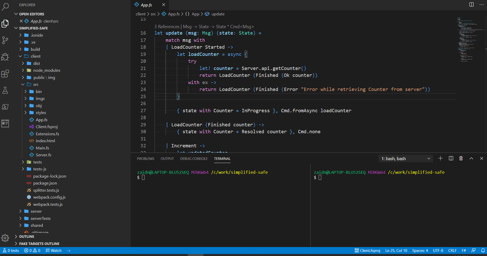

# Simplified SAFE Stack

A lightweight alternative template to the full-fledged official [SAFE Template](https://github.com/SAFE-Stack/SAFE-template). Lowers the entry barrier by choosing the simplest possible opinionated defaults:
 - Nuget for package management
 - [FAKE](https://fake.build/) build script as a console project (see ./build)
 - [Saturn](https://github.com/SaturnFramework/Saturn) as server web framework
 - [Fable.Remoting](https://github.com/Zaid-Ajaj/Fable.Remoting) for client-server communications
 - [Feliz](https://github.com/Zaid-Ajaj/Feliz) as the React DSL on the front-end
 - [Expecto](https://github.com/haf/expecto) for server unit-tests project
 - [Fable.Mocha](https://github.com/Zaid-Ajaj/Fable.Mocha) for client unit-tests project (runs in Node.js when on CI servers or live during development)
 - [Serilog](https://serilog.net) for logging server-side stuff
 - Simple application variable configuration (see below sections)

### Using This Template

Clone this repository or use it as template via Github UI to get started. Currently there are no plans to publish a separate dotnet template for it.

### Running The Application

To work with and develop the application, you need to both the server and the client project running at the same time. The server application is in the `server` directory and the client is in `client` directory. To run them both, simply open two shell tabs, each for either applications then:
```bash
  Shell tab c:\project\simplified-safe   Shell tab c:\project\simplified-safe
 -------------------------------------- --------------------------------------
  > cd server                            > cd client
  > dotnet restore                       > npm install
  > dotnet run                           > npm start
```
As shown here below



The server web application starts listening for requests at `http://localhost:5000` where as the client application will be hosted at `http://localhost:8080` during developments. All web requests made from the front-end are automatically proxied to the backend at `http://localhost:5000`. In production, there will no proxy because the front-end application will be served from the backend itself.

> That is unless you are hosting the backend serverless and would like to host the front-end project separately.

### Available Build Targets

You can easily run the build targets as follows:
 - `./build.sh {Target}` on Linux, Mac or simulated bash on Windows
 - `build {Target}` on Windows
 - Hitting F5 where `Build.fsproj` is the startup project in Visual Studio/Rider

There are a bunch of built-in targets that you can run:
 - `Server` builds the server in Release mode
 - `Client` builds the client in production mode
 - `Clean` cleans up cached assets from all the projects
 - `ServerTests` runs the server unit-tests project
 - `ClientTests` runs the client unit-tests project by compiling the project first and running via Mocha in node.js
 - `LiveClientTests` runs a standalone web application at `http://localhost:8085` that shows test results from the unit tests and recompiles whenever the tests change.
 - `Pack` builds and packs both server and client into the `{solutionRoot}/dist` directory after running unit tests of both projects. You can run the result application using `dotnet Server.dll` in the `dist` directory.
 - `PackNoTests` builds and packs both server and client projects into `{solutionRoot}/dist` without running tests.

> NOTE: while inside your IDE, build targets like `Clean` and restore can fail because the IDE locks cached asset files inside of `obj` directories which disallows the target from deleting them. When this happens, you have to close the IDE and run the targets from the terminal. Do not run build targets while running the application.

### Configuring application variables: Server

The server web application picks up the environment variables by default from the host machine and makes them available from an injected `IConfiguration` interface. However, it adds a nice feature on top which allows to add more application-specific local variables by adding a JSON file called `config.json` inside your `server` directory:
```json
{
  "DATABASE_CONNECTIONSTRING": "ConnectionString",
  "APP_NAME": "SimplifiedSafe",
  "VERSION": "0.1.0-alpha"
}
```
Just including the file will allow the variables to be picked up automatically and will also be made available through the `IConfiguration` interface.

### Configuring application variables: Client

Even the client can use build variables. Using the `Config.variable : string -> string` function, you can have access to the environment variables that were used when the application was compiled. Webpack will pick them up automatically by default. To use local variables other than the environment variables, you add a file called `.env` into the `client` directory. This file is a dotenv variables file and has the following format:
```
KEY1=VALUE1
KEY2=VALUE2
WELCOME_MESSAGE=Welcome to full-stack F#
```
Then from your Fable application, you can use the variables like this:
```fs
Config.variable "WELCOME_MESSAGE" // returns "Welcome to full-stack F#"
```
Since this file can contain variables that might contain sensitive data. It is git-ignored by default.

### Injecting ASP.NET Core Services

Since we are using Fable.Remoting in the template, make sure to check out the [Functional Dependency Injection](https://zaid-ajaj.github.io/Fable.Remoting/src/dependency-injection.html) article from the documentation of Fable.Remoting that goes through the required steps of injecting services into the functions of Fable.Remoting APIs

### IIS Support

The bundled application you get by running the `Pack` build target can be used directly as an application inside of IIS. Publishing on IIS requires that you make a separate Application Pool per .NET Core application with selected .NET CLR Version = `No Managed Code`. Then creating a new IIS Application which into the newly created Application Pool and setting the Physical Path of that Application to be the `dist` directory.